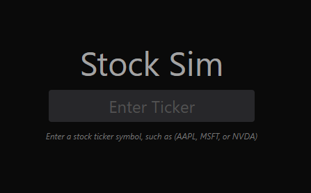

# Stock Sim
## Live Demo: https://stock-market-sim.vercel.app/ 

Stock Sim is a tool that enables users to calculate the returns of specific assets using historical stock market data. Stock Sim does not make any predictions about future performance. Instead, it simply provides insights into how a hypothetical investment would have performed in the past.

Users can search for assets using their ticker symbol. This search includes not only individual stocks but also ETFs, mutual funds, and certain popular cryptocurrencies. Once an asset is chosen, a chart showing its price over time appears. From this point, the user can choose between three different types of simulations, which are detailed below.

# Lump Sum
Calculates how much money the user would have on the simulation end date, assuming that they invested a specific amount on the initial investment date.

# Dollar Cost Average
Similar to "Lump Sum", but instead of investing all the money at once, the provided amount of money is invested at regular intervals specified by the user. 

# Best/Worst Intervals
Given a specified interval length, calculates return percentiles for periods of that length. 

